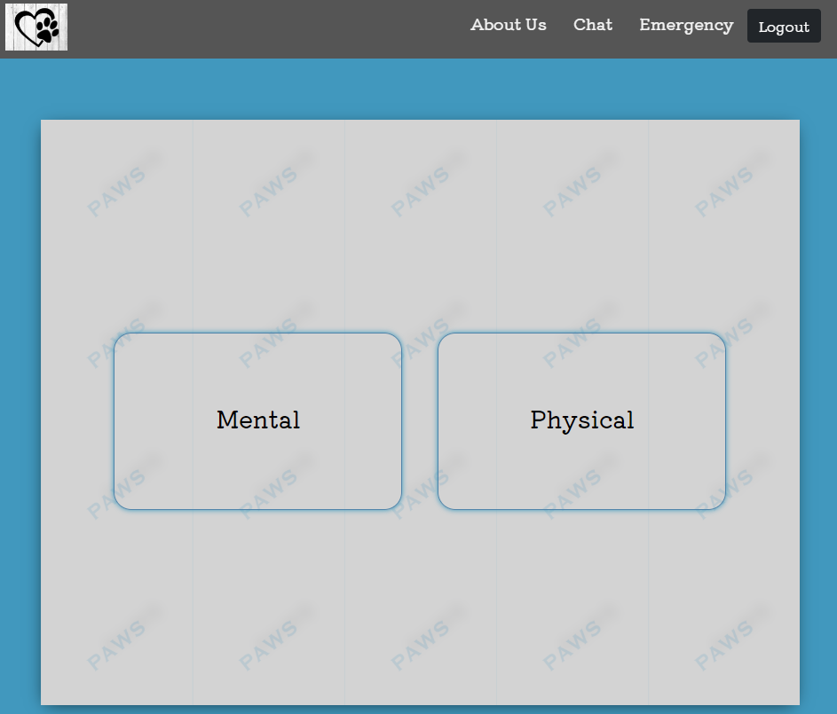
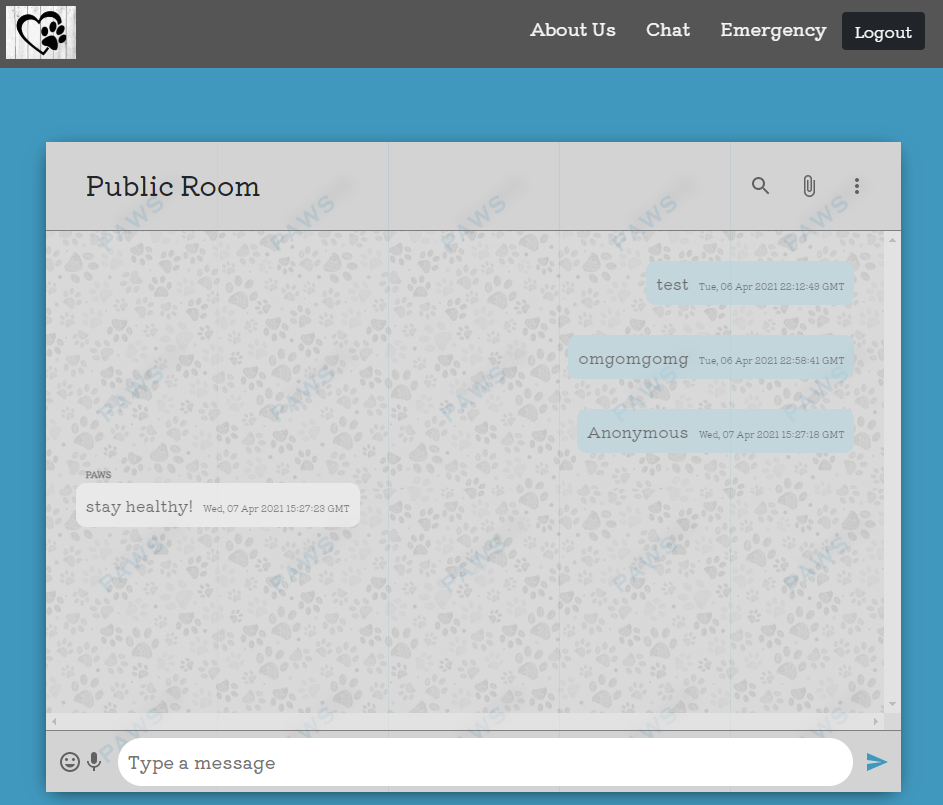

## Paws mental health

A mental healh real-time chat website. Speak to psychologists or meet new people in the public chatroom.

## Live application

https://paws-chat-app.herokuapp.com/

## Running the tests

There were no automated tests during the process of this application. 

## Built With

* [MongoDB](https://www.mongodb.com/) - Cloud database
* [Mongoose](https://mongoosejs.com/) - Mongodb object modeling for node.js
* [Express](https://expressjs.com/) - Web freamework for node.js
* [React](https://reactjs.org/) - A Javascript library for building user interfaces
* [React-Hooks](https://reactjs.org/docs/hooks-intro.html) - Use state and other features without writing a class
* [Nodejs](https://nodejs.org/en/) - Used to launch the application
* [Pusher](https://pusher.com) - Responsible for realtime experience
* [Axios](https://www.npmjs.com/package/axios) - Promise based HTTP client for the browser and node.js
* [Bootstrap](https://getbootstrap.com/) - Styling toolkit
* [Bcrypt](https://www.npmjs.com/package/bcrypt) - Used to hash passwords
* [JSON-web-token](https://jwt.io/) - Used to decode, verify and generate safety JWT token

## Contributing

There are many ways in which you can participate in the project, for example: 
* Submit bugs and feature requests to the email below, and help us verify as they are checked in 
* Review source code changes
* Review the documentation and make pull requests for anything from typos to new content